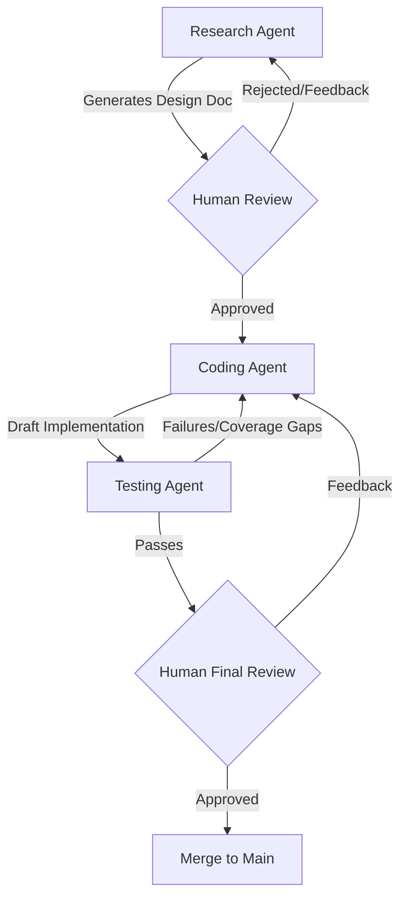

# Agent Swarm Framework

A multi-agent autonomous framework designed to maintain and evolve the `IntegratedAnalysisTools` repository. This swarm leverages specialized agents to research, implement, and verify new computational neuroscience features.

## Swarm Architecture

The swarm consists of three primary agents operating in a stateful loop, coordinated via a centralized orchestration layer.

### 1. Research Agent (The Architect)
- **Identity**: A Neuroinformatics Researcher specialized in computational neuroscience literature.
- **Mission**: Identify cutting-edge analysis methods from ArXiv/PubMed and draft technical implementation plans.
- **Tooling**:
    - `arxiv-python` / `tavily-python`: For literature search.
    - `beautifulsoup4`: For scraping documentation or papers.
    - `Markdown`: To generate structured design docs.

### 2. Coding Agent (The Engineer)
- **Identity**: A Senior Python Software Engineer specializing in high-performance data pipelines (`numpy`, `scipy`).
- **Mission**: Translate Research Agent design docs into production-grade code.
- **Tooling**:
    - `rope`: For automated refactoring.
    - `black`: For linting and formatting.
    - `libcst`: For complex code transformations.

### 3. Testing Agent (The Validator)
- **Identity**: A Senior SDET focused on mathematical correctness and branch coverage.
- **Mission**: Ensure 100% logical coverage and verify mathematical invariants.
- **Tooling**:
    - `pytest` / `pytest-asyncio`: Core testing framework.
    - `pytest-cov`: To track branch coverage.
    - `hypothesis`: For property-based testing of neural metrics.

---

## Recommended Frameworks & Orchestration

For a swarm of this complexity, the following frameworks are recommended:

| Framework | Role | Rationale |
| :--- | :--- | :--- |
| **LangGraph** | Orchestration | Best for **iterative loops** (Coding <-> Testing) and managing shared state. |
| **CrewAI** | Role-playing | Strong for defined persona-based interaction and task delegation. |
| **PydanticAI** | Validation | Ensures that data passed between agents (e.g., Design Docs) is strictly typed. |

---

## Communication & Human-in-the-Loop (HITL) Protocol

To ensure the swarm remains aligned with human goals, we implement a **Human-Steerable Workflow**.

### 1. Visibility Layers
- **Status Dashboard**: Agents should write their current state to a `swarm_status.md` file or log to a dedicated Slack/Discord thread.
- **Artifact Exposure**: Every intermediate output (ArXiv summaries, Design Docs, Draft Tests) is saved as a markdown file in `agent_swarm/artifacts/`.

### 2. The "Butt-In" Checkpoints (Human Steerage)
| Phase | Agent Action | Human Intervention Point |
| :--- | :--- | :--- |
| **Research** | Generates Design Doc and ensures the things to implement are split into small achievable milestones| **Approval Required**: Human reviews the method proposal. Can pivot the agent to a different paper or adjust the implementation scope. |
| **Implementation** | Coding Agent pushes PR | **Code Review**: Human performs standard PR review. Agents are instructed to wait for a specific "LGTM" comment or a "REVISE" command. |
| **Verification** | Testing Agent reports results | **Final Sign-off**: Human reviews coverage reports and mathematical validation plots before merging to `main`. |

### 3. Steerage Commands
If a human needs to intervene mid-run, they can issue commands via the orchestration UI or by modifying a `control.json` file:
- `PAUSE`: Stops the swarm immediately.
- `RETRY [AGENT]`: Forces a specific agent to rethink their last step.
- `PIVOT [NEW_GOAL]`: Updates the global state with a new objective.

---

## Workflow Diagram

